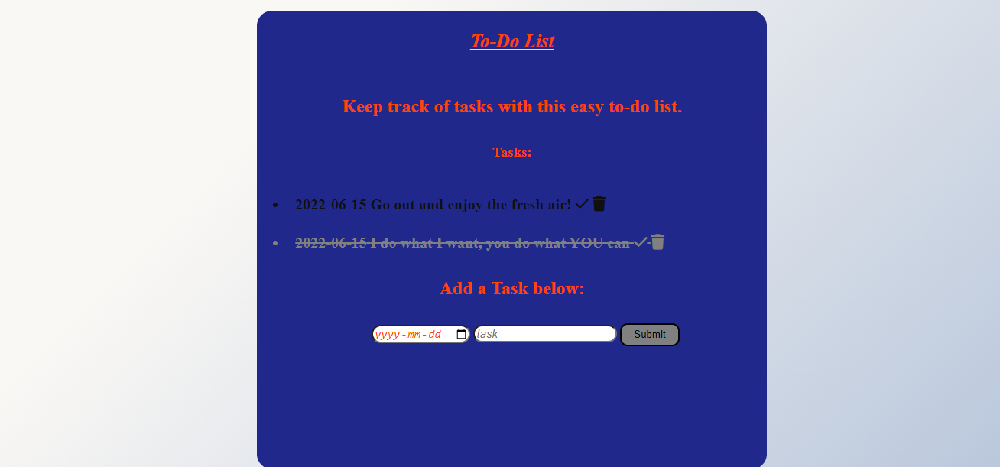

# previous-express-todo
This project shows a user friendly way to track your daily tasks and keep them organized in detail as they can be checked off, cleared and more.

## How It's Made:

**Tech used:** HTML, CSS, JavaScript, Node.js, MongoDb

I utilized my skills in javaScript, HTML and CSS to capture an inviting application for users. I also utilized Mongo.Db and Node.js to serve up information to a user after they send a request to my server. I am able to view and manipulate(delete) users information as they provide it.

## Lessons Learned:
I learned to store users information in my database which proved to be beneficial. This acted as a guide in seeing that information was accessed and provided efficiently.